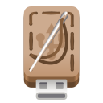

<p align="center">

</p>

<h1 align="center">
Tailor
</h1>

<p align="center">Create bootable drives</p>

> [!NOTE]
> If you are interested in contributing code to this app (Thank you!),
> please see the [style rules](./CONTRIBUTING.md).

> [!NOTE]
> If you are interested in contributing translations to Tailor (Thank you!),
> please see the [Weblate project](https://translate.alt-gnome.ru/projects/tailor/).

Tailor is an application for writing OS images to USB drives. Pick an OS and
edition from the built-in catalog (or supply your own ISO), pick a target
drive, and Tailor downloads, verifies, and flashes it.

### Installing

<a href='https://flathub.org/apps/details/org.altlinux.Tailor'></a>

Clone the repository and run these commands inside the project root:

```sh
meson setup build --prefix=/usr
ninja -C build
meson -C build install
```

Or build as a Flatpak:

```sh
flatpak-builder build-dir build-aux/flatpak/org.altlinux.Tailor.json
```

A Windows installer (`.exe`, built via MSYS2/NSIS) is published on every
release and nightly build - see
[Releases](https://altlinux.space/qualimock/Tailor/releases).

You will need the following dependencies installed, along with a C
compiler, `vala`, `meson`, and `ninja`:

| Dep Name                                                       | `pkg-config` Name  | Justification                    |
|-------------------------------------------------------------------|----------------------|--------------------------------------|
| [libadwaita](https://gitlab.gnome.org/GNOME/libadwaita)           | `libadwaita-1`       | UI toolkit                          |
| [libosinfo](https://gitlab.gnome.org/GNOME/libosinfo)             | `libosinfo-1.0`      | OS/edition/image metadata           |
| [libgee](https://gitlab.gnome.org/GNOME/libgee)                   | `gee-0.8`            | Collections used across the model   |
| [glib/gio](https://gitlab.gnome.org/GNOME/glib)                   | `gio-2.0`, `gio-unix-2.0` | Async I/O, D-Bus                |
| [udisks2](https://github.com/storaged-project/udisks)             | `udisks2`            | Drive detection and flashing        |
| [libsoup](https://gitlab.gnome.org/GNOME/libsoup)                 | `libsoup-3.0`        | Image downloads                     |

### Contributing

See [CONTRIBUTING.md](./CONTRIBUTING.md) for code style rules.

### Changelog

See [CHANGELOG.md](./CHANGELOG.md).

### License

GPL-3.0-or-later, see [COPYING](./COPYING).
